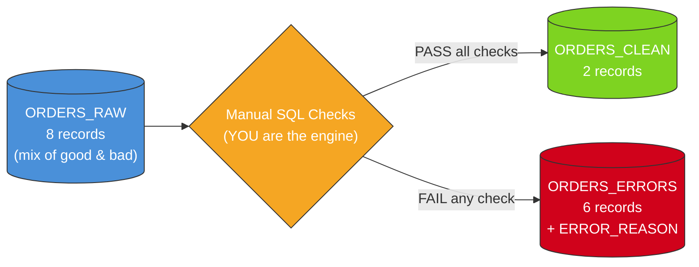
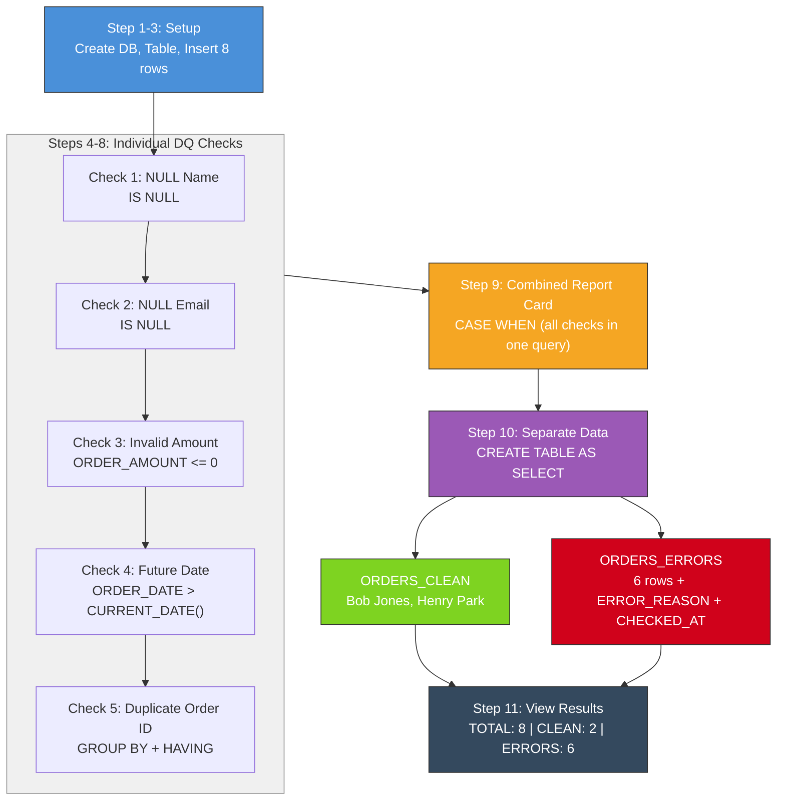
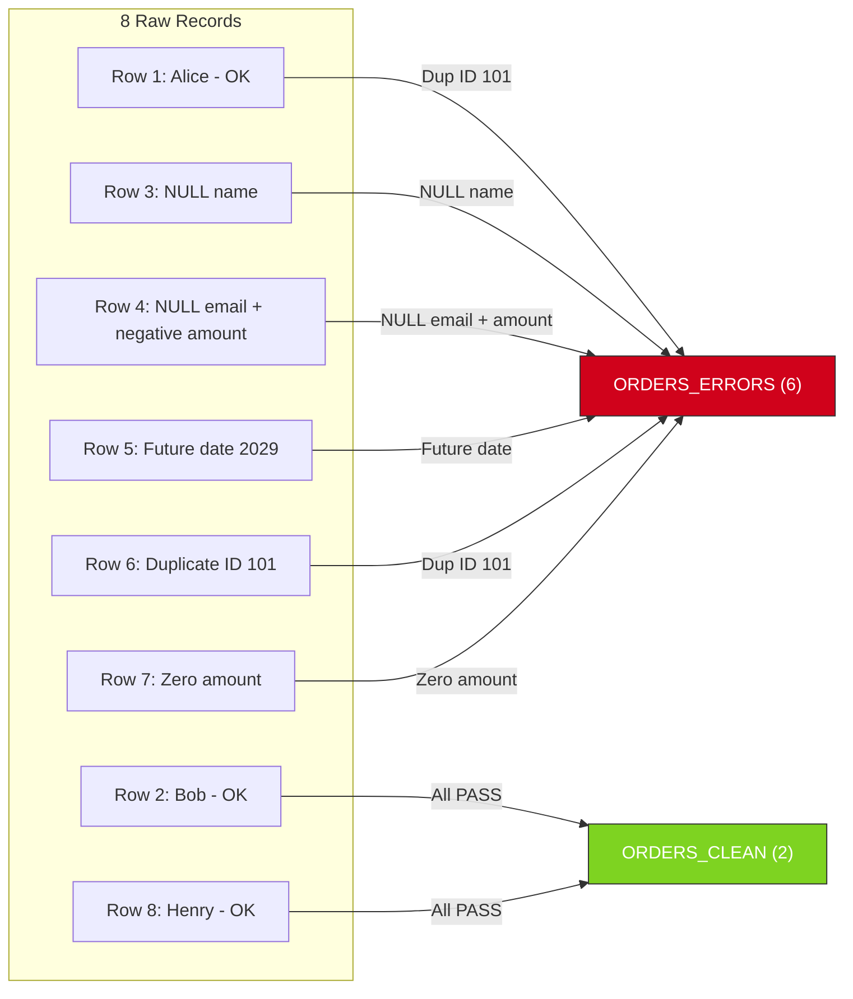

# Phase 1 — My First Data Quality Check

**Level:** Beginner | **Time:** 15-20 minutes | **Complexity:** Plain SQL only

[](https://www.snowflake.com/)
[](https://docs.snowflake.com/en/sql-reference.html)
[](../../LICENSE)

---

## Goal

Understand what Data Quality (DQ) is and run your first validation checks using nothing but basic SQL.

No stored procedures. No dynamic SQL. No cursors. Just `SELECT`, `CASE WHEN`, and `WHERE`.

---

## What You Will Learn

| # | Concept | SQL Used |
|---|---------|----------|
| 1 | Find missing values | `IS NULL` |
| 2 | Check value ranges | `WHERE amount <= 0` |
| 3 | Detect future dates | `CURRENT_DATE()` |
| 4 | Find duplicates | `GROUP BY / HAVING COUNT(*) > 1` |
| 5 | Build a report card | `CASE WHEN ... THEN ... END` |
| 6 | Separate good from bad | `CREATE TABLE AS SELECT` |

---

## Architecture

### Mermaid: High-Level Data Flow



### Mermaid: Step-by-Step Validation Flow



### Mermaid: What Each Check Catches



### ASCII Fallback (for terminals/Snowsight)

```
+-------------------------------------------------------+
|              PHASE 1 — BEGINNER DQ                     |
+-------------------------------------------------------+
|                                                       |
|  [ORDERS_RAW]                                         |
|       |                                               |
|       |--- SELECT WHERE (check each rule)             |
|       |                                               |
|       +---> [ORDERS_CLEAN]   (rows that PASSED)       |
|       |                                               |
|       +---> [ORDERS_ERRORS]  (rows that FAILED)       |
|                                                       |
|  Checks: NULL, Range, Date, Duplicates                |
|  Method: Manual SQL queries (CASE WHEN)               |
|  Automation: NONE (you run each query by hand)        |
+-------------------------------------------------------+
```

**Key idea:** You are the engine. You write each check manually.

---

## Prerequisites

- Snowflake account (any edition)
- Basic SQL: `SELECT`, `INSERT`, `CREATE TABLE`
- Any role with `CREATE DATABASE` privilege

---

## Repository Structure

```
phase_1_beginner_dq/
|-- sql/
|   |-- DQ_LEVEL_1_BEGINNER.sql   # Complete SQL file (run top to bottom)
|-- doc/
|-- README.md                      # This file
|-- LINKEDIN_POST.md               # Ready-to-publish LinkedIn content
|-- LINKEDIN_CAROUSEL.md           # Slide-by-slide carousel content
```

---

## Quick Start

1. Open `phase_1_beginner_dq/sql/DQ_LEVEL_1_BEGINNER.sql` in Snowsight
2. Run Steps 1-3 (boilerplate: database, table, sample data)
3. Run Steps 4-8 one at a time (individual DQ checks)
4. Run Step 9 (combined report card)
5. Run Steps 10-11 (separate clean/error data, view results)

---

## Cleanup

```sql
-- Uncomment and run when done:
-- DROP DATABASE IF EXISTS DQ_BEGINNER_LAB;
```

---

## What's Next

After completing Phase 1, you'll understand the core DQ pattern: **check → separate → report**.

**Phase 2** takes this further by wrapping all checks into a Stored Procedure that runs automatically with one command.

---

## License

This project is licensed under the MIT License — see the [LICENSE](../../LICENSE) file.

---

## Author

**Malaya Kumar Padhi**
Senior Solution Architect | Data & AI Platforms

[](https://www.linkedin.com/in/mkpadhi/)
[](https://github.com/Techy-Malay/snowflake-data-validation-gateway)

---

`#Snowflake` `#DataQuality` `#SQL` `#DataEngineering`
