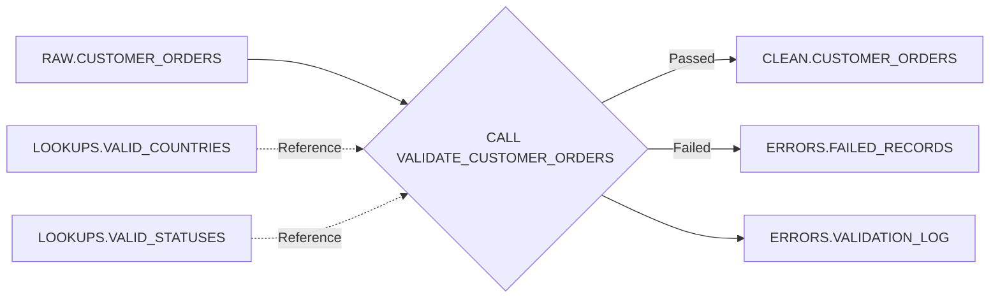
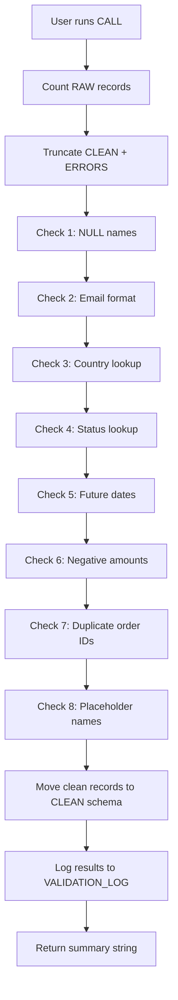

# Phase 2 — Building a Real Validation System


> Move from manual SQL checks to a **Stored Procedure** that validates ALL rules with a single `CALL` command. Introduce pattern matching, error logging, and JSON record capture.

**Level:** Intermediate | **Time:** 30-40 minutes | **Complexity:** Stored Procedures + Pattern Matching

---

## Architecture
### Data Flow (Mermaid)


### Data Flow (ASCII)

```
┌─────────────────────┐
│  RAW.CUSTOMER_ORDERS│
└─────────┬───────────┘
          │
          ▼
┌─────────────────────────────────────┐
│   CALL VALIDATE_CUSTOMER_ORDERS()   │
│                                     │
│  ▸ NULL checks                      │
│  ▸ REGEXP_LIKE (email format)       │
│  ▸ Range checks (amount > 0)       │
│  ▸ Date checks (no future dates)   │
│  ▸ Lookup validation (country/status)│
│  ▸ Uniqueness (duplicate order IDs) │
│  ▸ Placeholder detection (TEST/N/A) │
│  ▸ OBJECT_CONSTRUCT (JSON capture)  │
├──────────┬──────────────────────────┤
│          │                          │
│    PASSED│                   FAILED │
│          ▼                     ▼    │
│  ┌──────────────┐  ┌──────────────┐│
│  │CLEAN.CUSTOMER│  │ERRORS.FAILED ││
│  │_ORDERS       │  │_RECORDS      ││
│  └──────────────┘  └──────────────┘│
│                                     │
│          ┌──────────────┐           │
│          │ERRORS.       │           │
│          │VALIDATION_LOG│           │
│          └──────────────┘           │
└─────────────────────────────────────┘

Reference Tables:
  LOOKUPS.VALID_COUNTRIES ──┐
  LOOKUPS.VALID_STATUSES  ──┴──▸ Used by validation checks
```

### System Flow (Mermaid)



---

## What You Will Learn

| # | Concept | SQL Used |
|---|---------|----------|
| 1 | Stored Procedures | `CREATE PROCEDURE ... CALL` |
| 2 | Variables | `LET v_count := ...` |
| 3 | Pattern matching | `REGEXP_LIKE` (email, phone) |
| 4 | JSON record capture | `OBJECT_CONSTRUCT` |
| 5 | Shorter IF-THEN | `IFF()` function |
| 6 | Error logging | Timestamp-based audit table |
| 7 | Lookup tables | Referential integrity checks |
| 8 | Multi-schema design | RAW, CLEAN, ERRORS, LOOKUPS |

---

## What Changed from Phase 1

| Phase 1 (Beginner) | Phase 2 (Intermediate) |
|---|---|
| Run each check by hand | One `CALL` runs all checks |
| Plain `WHERE` filters | `REGEXP_LIKE` for patterns |
| Error as text column | Full record captured as JSON (`OBJECT_CONSTRUCT`) |
| Single schema | Multiple schemas (RAW → CLEAN / ERRORS) |
| No logging | Error log with timestamps and counts |
| Hardcoded checks | Lookup table for referential integrity |

---

## Prerequisites

- Completed Phase 1 (understand CASE WHEN, IS NULL, GROUP BY)
- Snowflake account (any edition)
- Comfortable writing basic SQL

---

## Repository Structure
```
phase_2_intermediate_dq/
├── README.md
├── LINKEDIN_POST.md
├── LinkedIn_Carousel.md
├── sql/
│   └── DQ_LEVEL_2_INTERMEDIATE.sql
└── doc/
    └── .gitkeep
```

---

## Quick Start
1. Open `sql/DQ_LEVEL_2_INTERMEDIATE.sql` in Snowsight
2. Run sections top to bottom (each section is clearly marked with `-- ====` headers)
3. Steps 1-4 build the environment and load sample data
4. Step 5 creates the stored procedure
5. Step 6: `CALL ERRORS.VALIDATE_CUSTOMER_ORDERS();` — this is the key moment
6. Step 7: Examine results — clean records, failed records, error summary, scorecard

---

## Cleanup

```sql
-- Uncomment and run to remove everything:
-- DROP DATABASE IF EXISTS DQ_INTERMEDIATE_LAB;
```

---

## What's Next

Phase 2 wraps checks into a procedure, but the rules are still **hardcoded inside the procedure**. If you want to add a new rule, you have to edit the code.

**Phase 3** solves this: rules move to a **configuration table**. The engine reads rules at runtime. Zero code changes to add/modify rules.

---

## License

This project is licensed under the MIT License.

---

## Author
**Malaya Kumar Padhi**  
Senior Solution Architect | Data & AI Platforms

[](https://www.linkedin.com/in/mkpadhi/)
[](https://github.com/Techy-Malay/snowflake-data-validation-gateway)
---

`#Snowflake` `#DataQuality` `#StoredProcedures` `#DataEngineering` `#SQL` `#DataArchitecture`

**Author:** [Malaya Kumar Padhi](https://www.linkedin.com/in/mkpadhi/) | Senior Solution Architect — Data & AI Platforms  
*Part of the [Snowflake Data Validation Gateway](https://github.com/Techy-Malay/snowflake-data-validation-gateway) series.*
